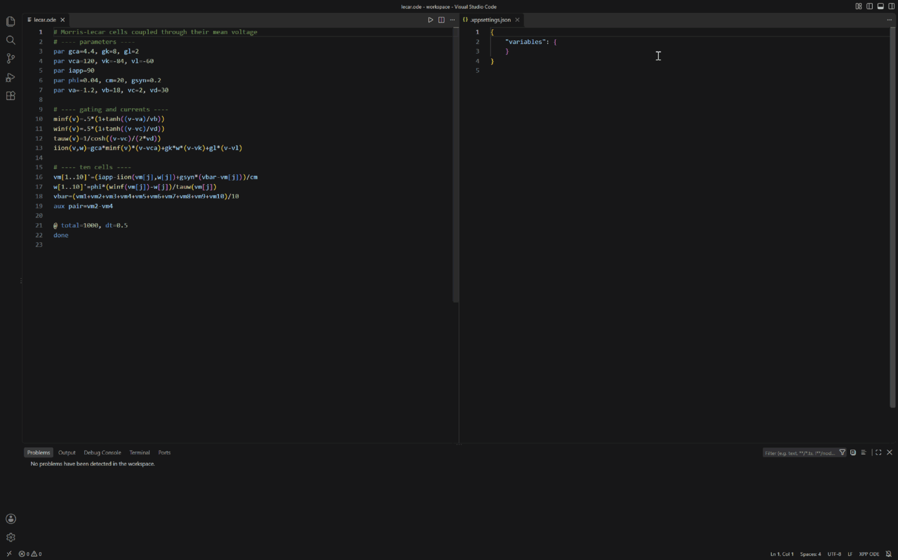
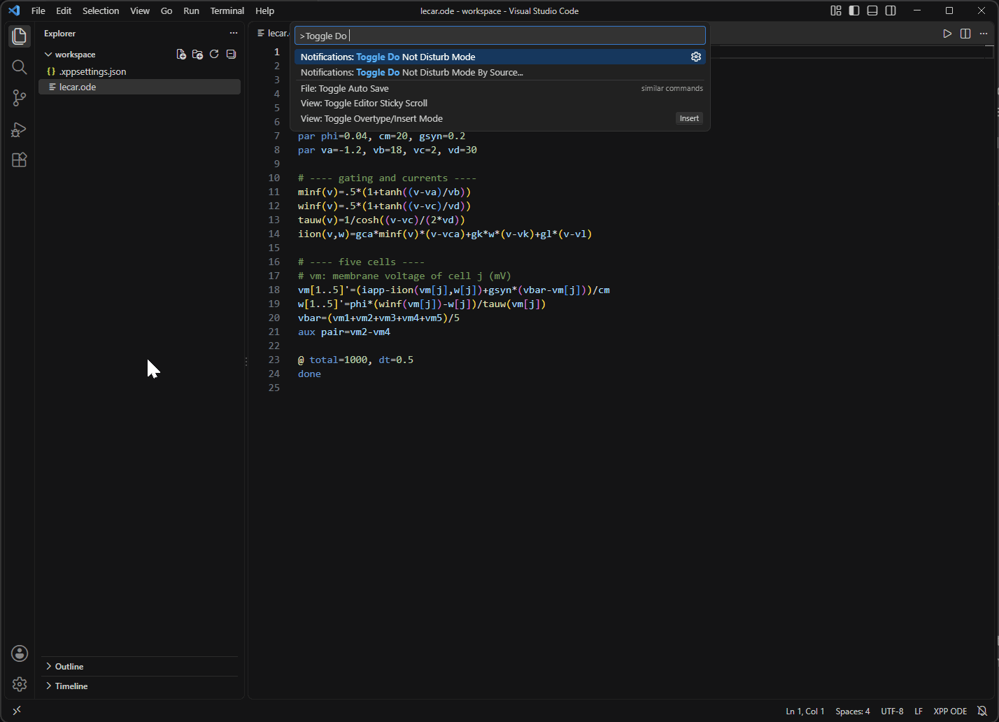
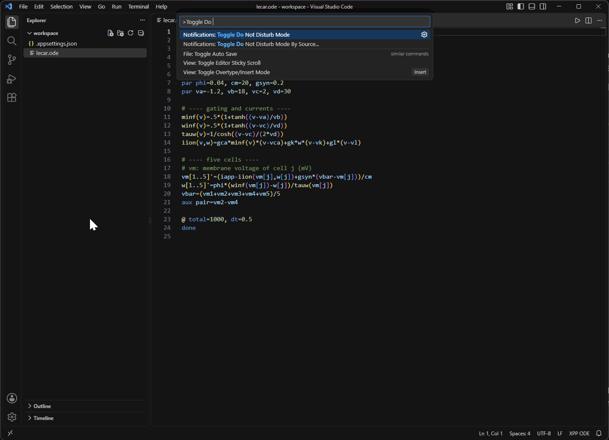

# XPP - VSCode Extension for XPPAUT Files

Write XPPAUT models (`.ode`, `.inc`) with highlighting, refactoring and checks that catch the mistakes XPP itself accepts silently.

- [Diagnostics](#diagnostics): missing `done`, unbalanced brackets, reserved or duplicate names, undefined and unused names, options XPP would silently ignore or misread, and [operator-precedence traps](#operator-precedence) such as `2*-3` or `2*3<4`.
- [Custom colours](#custom-colours-for-variables-and-parameters) per variable, parameter or category, shared by every model in a folder.
- [Descriptions on hover](#descriptions-on-hover): document a name in a `#` comment, like a docstring, and hovering it shows the text.
- Rename (`F2`) and highlight-all-occurrences for variables, parameters and functions, across `#include`d files; "Extract to Variable" from the context menu.
- Syntax highlighting, bracket matching, and commenting with `Ctrl+/`.
- A ["Run ODE File" button](#run-ode-file) that starts xppaut on the current file, with setup notes for Linux, macOS and Windows.



## What's new in 0.4.1

- [Operator-precedence checks](#operator-precedence): an error for a sign XPP rejects (`2*-3`) and for operators XPP does not have (`!=`, `&&`), with quick fixes; a warning where a comparison, `&` or `|` silently regroups arithmetic (`2*3<4` is `2*(3<4)`).
- [Initial values](#initial-values) checked the way XPP reads them: `init y=2*3` starts `y` at 2, and `y(0)=a` at 0.
- [`@` option values](#-option-values) checked the way XPP reads them: `@ total=2*3` is 2.
- [Descriptions on hover](#descriptions-on-hover) from `#` comments and from `.xppsettings.json`.
- `.xppcolors.json` becomes `.xppsettings.json` and `xpp-ode.identifierColors` becomes `xpp-ode.variables`; the old names still work for now ([how to move](#moving-from-xppcolorsjson)).

Every release is listed in the [changelog](CHANGELOG.md).

---

## Diagnostics

The extension checks each `.ode`/`.inc` file as you type and reports:

- **Errors**, for what stops XPP loading the file or makes it ignore a line: missing `done`, unbalanced brackets, reserved words used as names, duplicate or conflicting names, `solv` lines with spaces around `=`, a [sign where XPP allows none](#operator-precedence) (`2*-3`, `x^-2`), [operators XPP does not have](#operator-precedence) (`!=`, `&&`, `||`, `!x`), an `if` not written `if(c)then(a)else(b)`, an [`init` value](#initial-values) that is not a plain number (`init y=2*3` starts at 2), `@` options XPP drops because they are not exactly `name=value`, and [numeric `@` values that are not plain numbers](#-option-values) (`@ total=2*3` is 2, not 6).
- **Warnings**, for what loads but probably does not mean what you wrote: text after `done` (shown dimmed; XPP stops reading there), undefined names, unused parameters, fixed variables and functions (shown faded), initial conditions for names that are not state variables, lines XPP silently skips, unknown `@` option names, fixed variables named like a keyword (`p=1`), a [comparison, `&` or `|` next to arithmetic](#operator-precedence) (`2*3<4`, `-1<0`, `a<b<c`, `a|b-c`), a [formula in `y(0)=`](#initial-values) (`y` starts at 0), and a division by a literal `0` (XPP silently gives 4.5e14, not an error).
- **Information**, for legal surprises: `2^3^2` is `(2^3)^2`, `-2^2` is `-(2^2)`, and in `if(c)then(a)else(b)+5` the `+5` applies to the whole `if`.

Names defined in `#include`d files count as defined. Inside an `.inc` file the undefined-name check is off, because the including `.ode` file may define them.

<details>
<summary><strong>The XPP syntax rules behind these checks</strong></summary>

All of these were verified by running files through `xppaut` 8.0.

**How XPP decides what a line is**

| Line looks like | XPP reads it as |
|---|---|
| `word name ...` (a word, a **space**, then a name) | a declaration chosen by the first letters of `word` |
| `word=...` or `word = ...` | a fixed variable called `word`, whatever `word` is |
| `x'=`, `dx/dt=`, `x(t+1)=`, `x(t)=` | a state variable |
| `x(0)=` | an initial condition |
| `f(a,b)=` | a function |
| `!a=` | a derived parameter |
| `0=` | an algebraic condition |
| `@ ...` | options |
| `#...` or `"...` | a comment |
| a first word starting with `d` that is not followed by `=`, `'`, `(`, `[` or `/dt` (`done`, `d`, `done # notes`, even `done x=1`) | end of file, everything after it is ignored |
| anything else | **silently ignored** |

**Keyword prefixes.** Only the first letters of the keyword matter: `p`, `par`, `param`, `params` and `parameter` all declare parameters. Single letters work for `p`(ar), `i`(nit), `w`(iener), `n`(umber), `g`(lobal), `b`(dry), `v`(olt), `o`(ptions) and `d`(one); two letters are needed for `au`(x), `ma`(rkov), `ta`(ble), `se`(t), `so`(lv), `sp`(ecial), `ex`(port), `im`(port) and `on`(ly). The separator after the keyword must be a space; a tab makes XPP read `init<tab>x=5` as a fixed variable named `initx`.

**Keywords are not reserved names.** `p=1`, `par=1`, `done=1` and `dt=1` are all legal fixed variables, because the `=` directly after the word wins. The extension only warns about them because they are easy to misread. The names XPP really rejects are the builtin functions (`sin`, `heav`, `delay`, ...), `if`/`then`/`else`, `arg1`..`arg9`, `t`, `pi` and `set`.

**Where spaces around `=` matter.**

| Form | Spaces around `=` |
|---|---|
| `@ dt=0.1,total=100` | **not allowed**: `@ dt = 0.1` is silently ignored and the default is used |
| `solv y=-.5` | **not allowed**: XPP fails to load the file |
| `par a = 1`, `init x = 0`, `aux z = x`, `x' = -x`, `f(x) = 2*x`, `x(0) = 1`, `!a = b*2`, `0 = y-x`, `global 1 x-1 {x = 0}` | allowed |

**Lists.** `par` and `init` items may be separated by commas or by spaces (`par a=1  b=2`), and a parameter may be listed without a value (`par ind`, which gives it 0).

**Comments and `#`.** `#` starts a comment except inside braces, where it is the Volterra convolution operator: `y(t)=int{exp(-t)#x}`.

</details>

## Operator precedence



XPP's expression parser groups some expressions differently from ordinary maths, and refuses others outright. This is long-standing XPPAUT behaviour that existing models rely on; the extension only makes it visible. Hover over `^`, `**` or a comparison for the rule, and use the quick fix (`Ctrl+.`) on a rejected sign.

| you write | XPP reads it as | value | reported as |
|---|---|---|---|
| `2*-3` | — | **the file does not load**; quick fix: `2*(-3)` | error |
| `2*3<4` | `2*(3<4)` | **2** (not 0) | warning |
| `1+2<3+4` | `1+(2<3)+4` | **6** (not 1) | warning |
| `-1<0` | `-(1<0)` | **-0, i.e. false** (not true) | warning |
| `a<b<c` | `(a<b)<c` | **`3<2<1` is true** | warning |
| `a\|b-c` | `(a\|b)-c` | `2\|0-1` is **0** (not 1) | warning |
| `1+1&1` | `1+(1&1)` | **2** (not 1) | warning |
| `a!=b`, `a&&b`, `a\|\|b`, `!a` | — | **the file does not load**; quick fix: `not(a==b)`, `a&b`, `a\|b`, `not(a)` | error |
| `if 1>0 then 10 else 20` | — | **the file does not load**: only `if(c)then(a)else(b)` does | error |
| `2^3^2` | `(2^3)^2` | **64** (ordinary notation means 512) | information |
| `-2^2` | `-(2^2)` | **-4** (not 4) | information |

It all follows from one priority table: comparisons bind tighter than **all** arithmetic, the opposite of nearly every other language, and unary minus binds more weakly than both `^` and the comparisons.

| priority | operators |
|---|---|
| 7 | `^`, `**`, and every comparison: `<` `>` `<=` `>=` `==` `!=` |
| 6 | `*`, `/`, `&`, and unary minus (a separate operator, `~`) |
| 4 | binary `+`, `-`, `\|` |

<details>
<summary><strong>Each rule, with examples</strong></summary>

Everything below was confirmed by compiling the expression with `add_expr()` and running it through `evaluate()` in [xppautX](https://github.com/MuhammadMoustafa/xppautX), and the "will not load" cases by running the file through `xppautX -silent`.

### 1. `^` groups to the left

`2^3^2^2` is `((2^3)^2)^2` = 4096. `**` is the same operator, so `2**3**2` is 64 too.

```
x'=-a*x^2^3        # XPP: (x^2)^3, i.e. x^6
x'=-a*(x^2)^3      # the same thing, written so it cannot be misread
x'=-a*x^(2^3)      # what ordinary notation would have meant: x^8
```

### 2. Unary minus binds more weakly than `^`

This is usually what you wanted anyway, which is why it is only an information message:

```
aux e=-x^2         # -(x^2): negative for every x  -- and normally what you meant
aux e=(-x)^2       # x^2: positive for every x
```

It applies to scientific notation as well: `-3E-5^2` is `-(3E-5^2)` = -9e-10. The minus inside `1e-3` belongs to the number, not to an operator, so `1e-3^2` is `(1e-3)^2` = 1e-6.

### 3. Comparisons bind tighter than arithmetic

This is the one that quietly ruins results, so it is a warning. XPP evaluates the comparison first and then does the arithmetic on its `0` or `1`:

```
2*3<4              # XPP: 2*(3<4) = 2      -- not (2*3)<4 = 0
3-1<2              # XPP: 3-(1<2) = 2      -- not (3-1)<2 = 0
1+2<3+4            # XPP: 1+(2<3)+4 = 6    -- not (1+2)<(3+4) = 1
1/2<1              # XPP: 1/(2<1) -- a division by zero
(2*3)<4            # bracket what you want compared
```

A leading sign is the same rule, and it flips `if` branches silently:

```
f(t)=if(-t<0)then(a)else(b)     # XPP: if(-(t<0)) -- always -0, i.e. always the else branch
f(t)=if((-t)<0)then(a)else(b)   # what you meant
```

`-1<0` is `-(1<0)` = -0, which is **false** even though -1 really is less than 0; and `-1>=0` is `-(1>=0)` = -1, which is **true** (any non-zero value is). Operators weaker than a comparison need no brackets: `1<2&3<4` is `(1<2)&(3<4)`, and `2^2<3` is `(2^2)<3`, both as expected.

### 4. A sign is only allowed at the start, after `(` or after `,`

Anywhere else XPP rejects the expression and the file does not load at all (`ERROR compiling X'`), so the extension reports it as an error:

```
x'=2*-3            # rejected -- write 2*(-3)
x'=x^-2            # rejected -- write x^(-2)
x'=a+-b            # rejected -- write a+(-b)
f(t)=if(t<-1.3)... # rejected -- write if(t<(-1.3))
x'=+2*a            # rejected -- XPP has no unary "+" at all, not even as "(+2)"
x'=-3E-5*a         # fine: the sign starts the expression
par a=-3E-5        # fine: a declaration value is a plain number, not an expression
```

The quick fix writes the working form for you: it brackets a minus (`2*-3` becomes `2*(-3)`) and drops a plus (`2*+3` becomes `2*3`).

### 5. `a<b<c` does not mean what it says

Comparisons group to the left, so `a<b<c` is `(a<b)<c`: the second comparison tests the first one's `0` or `1` against `c`:

```
0<x<1              # XPP: (0<x)<1 -- true only when x is NOT above 0
(0<x)&(x<1)        # what you meant
```

`3<2<1` is `(3<2)<1` = `0<1` = **1, true**, although neither half holds.

### 6. `&` is a `*`, and `|` is a `+`

`&` has the priority of `*` and `/`, and `|` that of `+` and `-`, so they group with arithmetic from left to right instead of after it:

```
1+1&1              # XPP: 1+(1&1) = 2   -- not (1+1)&1 = 1
a|b-c              # XPP: (a|b)-c       -- not a|(b-c)
a*b&c              # (a*b)&c, as expected: no warning
(a+b)&c            # bracket what you want combined
```

### 7. Operators XPP does not have

`!=` is in XPP's operator table but its reader stops at the `!`, so there is no working not-equal. `&&`, `||` and a `!` in front of a value are not XPP operators either. All of them stop the file loading; the quick fix writes `not(a==b)`, `&`, `|` or `not(a)`. (`!name=...` at the start of a line is a derived parameter and is fine.)

### 8. `if` needs every part in brackets

Only `if(c)then(a)else(b)` loads. XPP removes spaces before reading, so `if(c)then 10 else 20` becomes `then10else20`, and the `e` of `else` is read as the exponent of `10` (`illegal expression: 10EL`). An `if` without `else` does not load either. An operator right after the `else` part applies to the whole `if`: `if(1>0)then(10)else(20)+5` is 15.

### 9. Division by zero is silent

XPP replaces a zero divisor with about 2.2e-15, so `1/0` is 4.5e14 and `0/0` is 0, with no error. A divisor that is literally `0` is a warning.

</details>

The error is always reported, like everything else XPP rejects. The advisory findings have one setting each:

```jsonc
// .vscode/settings.json -- "warning", "information", "hint" or "off"
"xpp-ode.precedence.power": "information",   // 2^3^2 and -2^2
"xpp-ode.precedence.comparison": "warning",  // 2*3<4, 1+2<3+4, -1<0, a<b<c
"xpp-ode.precedence.logical": "warning"      // 1+1&1, a|b-c
```

## `@` option values

An `@` line is not made of expressions. XPP splits it on commas **and spaces** (`@ dt=.05 meth=cvode total=100` sets all three), and every piece must be exactly `name=value`. Numeric values are read with `atof()`, which stops at the first character that cannot be part of a number and never reports an error:

| you write | XPP uses | |
|---|---|---|
| `@ total=2*3` | `2` | not 6: `@` values are not expressions |
| `@ total=4abc` | `4` | |
| `@ total=(4)` | `0` | `atof` finds no number to start with |
| `@ total=` | *default* | the option is dropped entirely |
| `@ total= 4` | *default* | the value was split off, so the piece is not `name=value` |
| `@ total = 4` | *default* | reads as the three unrelated words `total`, `=`, `4` |
| `@ t0=-5` | `-5` | negative values are fine |
| `@ total=1e1` | `10` | as is scientific notation |

Work the value out yourself, or put it in a `par` and use that in your equations. Options that take a name, a file or a keyword (`meth=cvode`, `xp=x`, `output=out.dat`) are left alone.

## Initial values

Like `@` values, `init` values are plain numbers read with `atof()`, and an initial condition `y(0)=` is a number too:

| you write | `y` starts at | reported as |
|---|---|---|
| `init y=2*3` | **2** | error |
| `init y=a` (with `par a=2`) | **0** | error |
| `y(0)=a` | **0**: the formula is only kept as `y`'s history for delay equations | warning (information in a model that uses `delay`) |
| `y(0)=2*3` | **2** | warning |
| `x[1..5](0)=a*[j]` | `a`, `2a`, ... as written: array conditions are evaluated | — |
| `init y=-1.5e-3`, `y(0)=.5` | as written | — |

Work the value out yourself, or, for an array, use the `x[1..n](0)=` form.

## Custom colours for variables and parameters

Give any name in your models its own look, independent of the theme: the membrane voltage always red, every parameter bold green, builtins italic, one variable in a box. The colours follow the parser, so a parameter is coloured everywhere it is used, not only on its `par` line.

Put a `.xppsettings.json` in a folder, and it applies to every `.ode`/`.inc` file in that folder and its subfolders:

```json
{
    "variables": {
        "@states":     "#ff7b72",
        "@parameters": { "color": "#7ee787", "fontWeight": "bold" },
        "@fixed":      { "color": "#d2a8ff" },
        "@builtins":   { "fontStyle": "italic" },
        "@options":    { "opacity": 0.6 },

        "v":    { "color": "#ffffff", "borderColor": "#ff7b72", "borderRadius": "3px" },
        "g_*":  { "textDecoration": "underline" },
        "iapp": { "light": { "color": "#a00000" }, "dark": { "color": "#ff8888" } }
    }
}
```

Reading it: state variables are salmon and parameters bold green everywhere they appear. `v` is white in a salmon box, because an exact name wins over its group. Every name starting with `g_` (`g_na`, `g_k`, `g_l`) is underlined in the theme's colour, because a wildcard wins over its group and replaces it entirely. `iapp` is dark red on light themes and pale red on dark ones. Option names on `@` lines are faded.

Hex colours show a swatch you can click for the colour picker. Completion (`Ctrl+Space`, or typing `"` or `@`) offers the groups, every name declared in the folder's models with its kind, and the style properties with their allowed values; misspelled properties and invalid values are underlined. Changes apply immediately.

### Where to put the configuration

| Place | Applies to | How |
|---|---|---|
| `"variables"` in a `.xppsettings.json` in a folder | every `.ode`/`.inc` file in that folder and its subfolders | create the file; a file in a subfolder overrides one in a parent folder, key by key |
| `xpp-ode.variables` in `.vscode/settings.json` | the whole workspace | Settings > search "XPP-ODE" > edit in settings.json |
| `xpp-ode.variables` in user settings | every workspace | same |

Both places take the same object: the setting holds it directly, the file under its `"variables"` key. Files override the setting, key by key (see [Which rule applies](#which-rule-applies)).

### Keys

| Key | Meaning | Example |
|---|---|---|
| a name | that identifier, case-insensitive; an array name also covers its members | `"v"`, `"gsyn"`, `"u"` (covers `u[j]`, `u[0..9]`, `u0`...`u9`) |
| a name with `*` | every identifier matching the pattern (`*` = any letters, digits or `_`) | `"v_*"`, `"*_syn"`, `"u*x"` |
| `@group` | a whole category, resolved by the parser | `"@states"`, `"@parameters"` |

| Group | Contains |
|---|---|
| `@states` | state variables: `x'=`, `dx/dt=`, `x(t+1)=`, `x(t)=`, `solv` |
| `@parameters` | `par` and `number` parameters, `!name=` derived parameters |
| `@fixed` | fixed variables `name=expression` |
| `@functions` | user functions `f(x)=` |
| `@aux` | `aux` quantities |
| `@wiener` | `wiener` variables |
| `@markov` | `markov` variables |
| `@tables` | `table` and `special` names |
| `@options` | option names on `@` lines (`dt`, `total`, `xp`, ...) |
| `@builtins` | builtin functions and constants (`sin`, `heav`, `t`, `pi`, ...) |
| `@keywords` | declaration keywords (`par`, `init`, `aux`, `done`, ...) |

Comments and text after `done` are never coloured.

### Which rule applies

Every name gets **at most one** entry, chosen by these rules in order:

1. **Exact name** (`"v"`). For an array name, its members too (`"u"` covers `u0`...`u9`), unless a member has its own entry.
2. **Wildcard** (`"g_*"`). When several match, the one listed **last** wins.
3. **Group** (`"@parameters"`). A name belongs to one group only, so groups never compete.

The chosen entry **replaces** the others; properties are not combined. With `"@parameters": { "fontWeight": "bold" }` and `"gna": "#ff0000"`, `gna` is red and **not** bold. Whatever the entry leaves out comes from the theme, not from a lower rule; to keep the bold, write it again: `"gna": { "color": "#ff0000", "fontWeight": "bold" }`.

When the same key appears in several places, the one closest to the file wins: the setting, then each `.xppsettings.json` from the workspace root down to the file's own folder, each overriding the one before for that key. The look and the `description` are overridden separately, so an entry that only adds a `description` keeps the colours given further up. The order above is applied afterwards, whatever the source: an exact name in your user settings still beats a wildcard in the folder's `.xppsettings.json`. Wildcards from all sources form one list, with the closer files' wildcards after (and so above) the setting's.

Inside a style, `light`/`dark` properties override the base properties for that kind of theme.

### Values

A value is either a hex colour string or a style object.

```json
"v": "#ff7b72"
"v": { "color": "#ff7b72", "fontWeight": "bold" }
```

| Property | Allowed values | Notes |
|---|---|---|
| `color` | `#rgb`, `#rrggbb`, `#rrggbbaa` | text colour |
| `backgroundColor` | hex colour | use `aa` for a translucent highlight, e.g. `#ffff0040` |
| `fontWeight` | `bold`, `normal` | |
| `fontStyle` | `italic`, `normal` | |
| `textDecoration` | `underline`, `line-through`, `overline`, `underline wavy`, `underline dotted`, `underline dashed` | |
| `opacity` | `0` to `1` | `0.5` fades the name |
| `borderColor` | hex colour | alone it draws a 1px solid box |
| `borderStyle` | `solid`, `dashed`, `dotted`, `double` | |
| `borderWidth` | length: `1px`, `0.1em` | |
| `borderRadius` | length: `3px` | rounded box corners |
| `light` | object with the properties above | applied only in light themes |
| `dark` | object with the properties above | applied only in dark themes |
| `description` | text | shown when hovering the name, see [Descriptions on hover](#descriptions-in-xppsettingsjson) |

Every VS Code theme declares itself as light, dark or high-contrast; `light`/`dark` entries are layered on top of the base properties for that kind of theme. Entries the extension cannot use (unknown group, bad colour, unknown top-level key, ...) are skipped and reported once as a warning; the rest still apply.

### Moving from `.xppcolors.json`

`.xppcolors.json` and the `xpp-ode.identifierColors` setting are deprecated. They still work in this release, with a warning, but will be removed:

- move the content of a `.xppcolors.json` under `"variables"` in a `.xppsettings.json` in the same folder, then delete the old file. While both exist, `.xppsettings.json` wins key by key;
- rename the setting `xpp-ode.identifierColors` to `xpp-ode.variables`; its value is unchanged. While both are set, `xpp-ode.variables` wins key by key.

## Descriptions on hover



Write what a name means in a `#` comment, like a docstring, and hovering the name anywhere in the code shows it with the name's kind:

```
par gna=120   # Maximal sodium conductance (mS/cm^2)
```

> **gna** — parameter
>
> Maximal sodium conductance (mS/cm^2) (line 1)

Names declared in `#include`d files show their descriptions too.

### Where to write a description

**After the code**, on the declaration line (or on any line of a line continued with `\`):

| Comment | Meaning |
|---|---|
| `par gna=120  # Max Na conductance` | one name on the line: the whole comment describes it |
| `par gna=120, gk=36  # gna: max Na; gk: max K` | `name: text` parts separated by `;` describe each name |
| `par gna=120, gk=36  # conductances (mS/cm^2)` | several names and a plain comment: **shared** by all of them |

The comment is split into parts only when **every** part is `name: text` for a name on that line; otherwise it is plain text, so `par gna=120  # units: mS/cm^2` describes `gna` as "units: mS/cm^2".

**Above the declaration**, one `# name: text` line per name, directly above it (no blank line in between). Handy for long lists; other comment lines, such as section headers, are ignored:

```
# ---- sodium current ----
# gna: maximal sodium conductance (mS/cm^2)
# ena: sodium reversal potential (mV)
par gna=120, ena=50
```

Keys are case-insensitive.

### Arrays

An array such as `x[1..10]` is one name for a plain comment, and keys can pick its members:

| Key | Describes |
|---|---|
| `x: text` | the array and every member |
| `x[3..5]: text` | members `x3`..`x5` |
| `x[3,5]: text` | members `x3` and `x5`; lists and ranges mix: `x[1..3, 7, 9]` |
| `x7: text` | only `x7` |

```
# x: membrane voltage of cell j (mV)
# x[1..3]: excitatory cells
# x7: the pacemaker cell
x[1..10]'=-x[j]+i_syn[j]
```

A key for a member the array does not have (`x11:` or `x[9..12]:` above) is a warning.

### Several descriptions for one name

A name can have descriptions at several levels, and the hover shows them all, most specific first:

1. its own: `x7:`, or the plain comment on its own line;
2. a selection: `x[1..3]:`, `x[3,5]:`;
3. inherited: `x:` seen from a member, or a comment shared by the names of a line.

> **x7** — state variable (array x[1..10])
>
> the pacemaker cell (line 3)
>
> membrane voltage of cell j (mV) (line 1) — from x

Two descriptions at the **same** level (1 or 2) are a mistake: `x3` above described by both `x[1..3]:` and a later `x[3,5]:`, or `gna` described both above its line and after it. The later one wins (a comment after the code counts as later than the lines above), and the other is marked with a warning "Description of "x3" is overridden by line 12" that links to the winner. Its quick fix (`Ctrl+.`) removes the overridden description.

### Descriptions in `.xppsettings.json`

For names in files you cannot edit, or shared by a folder of models, add a `description` to the entry in [`.xppsettings.json` or `xpp-ode.variables`](#custom-colours-for-variables-and-parameters). An entry may hold only a description, which leaves the colours alone:

```json
{
    "variables": {
        "gna":         { "color": "#7ee787", "description": "Maximal sodium conductance (mS/cm^2)" },
        "v":           { "description": "Membrane potential (mV)" },
        "g_*":         { "description": "A conductance" },
        "@parameters": { "description": "Units: mS/cm^2 unless stated" }
    }
}
```

These are shown after the comments, each with its key. Unlike colours, the levels do not hide each other: a name gets the description of its own entry, of every matching wildcard (last listed first) and of its group. An array member also gets its array's (`"x"` for `x7`). Keys with a selection (`"x[1..3]"`) are not supported here.

## Run ODE File

The "Run ODE File" button (editor title bar of any `.ode` file) saves the file, opens an integrated terminal **in the file's folder**, and runs:

```
<xpp-ode.runCommand> "<file name>.ode"
```

It runs in the file's folder because xppaut looks for `#include`d files, `table` files and `dll_lib` libraries relative to the directory it is started from, and writes its output files there too.

The default command is `xppaut`, which works when xppaut is on your `PATH`. To change it: Settings (`Ctrl + ,` / `Cmd + ,`) > search "XPP-ODE" > **Run Command**. Typical values:

| Setup | Run Command |
|---|---|
| Linux, xppaut installed from the package manager or `make install` | `xppaut` |
| macOS with XQuartz, xppaut not on the PATH | `/usr/local/bin/xppaut` (or wherever you installed it) |
| Windows, xppaut installed inside WSL (with WSLg or an X server) | `wsl xppaut` |
| Windows, the Cygwin build from `xppwin.zip` | `C:\xppall\xppaut.exe` (see below) |
| Extra options for every run | `xppaut -xorfix`, `xppaut -silent`, ... |

Since only the file name is passed, `wsl xppaut` works without translating Windows paths: WSL starts in the same folder. The setting can be set per workspace (`.vscode/settings.json`), so a project can carry its own command.

<details>
<summary><strong>Windows with the Cygwin build</strong></summary>

The Windows `xppaut.exe` is an X11 program. It needs two things, or it exits with "Failed to open X-Display":

1. **An X server running**, such as [Xming](https://sourceforge.net/projects/xming/) or [VcXsrv](https://sourceforge.net/projects/vcxsrv/). It sits in the tray once started.
2. **The `DISPLAY` variable** telling xppaut where that server is. Starting the server does not set it; the `xpp.bat` shipped with xppaut sets `DISPLAY=127.0.0.1:0.0` for this reason.

The extension handles both with `xpp-ode.display` and `xpp-ode.xServer` (see [Settings](#settings)). Before each run it checks whether a server is listening on the display. If none is and `xpp-ode.xServer` is set, it starts the server and waits for it; otherwise it shows a warning naming the address and the fix, and still runs xppaut so you see its own message too.

Do not chain the server into the run command (`xming && xppaut`): `&&` waits for the first program to exit, and an X server never exits.

A complete Windows `.vscode/settings.json`:

```json
{
    "xpp-ode.runCommand": "C:\\xppall\\xppaut.exe",
    "xpp-ode.xServer": "\"C:\\Program Files (x86)\\Xming\\Xming.exe\" :0 -multiwindow -clipboard"
}
```

</details>

## Settings

| Setting | Default | Effect |
|---|---|---|
| `xpp-ode.variables` | `{}` | [colours, styles and descriptions](#custom-colours-for-variables-and-parameters) per name, wildcard or group |
| `xpp-ode.precedence.comparison` | `warning` | how to report [a comparison next to arithmetic](#operator-precedence): `warning`, `information`, `hint` or `off` |
| `xpp-ode.precedence.logical` | `warning` | how to report [`&` or `\|` next to arithmetic](#operator-precedence), same values |
| `xpp-ode.precedence.power` | `information` | how to report `2^3^2` and `-2^2`, same values |
| `xpp-ode.debounceDelay` | `300` | milliseconds to wait after typing before the file is checked again |
| `xpp-ode.runCommand` | `xppaut` | the command the [Run ODE File](#run-ode-file) button runs; the file name is appended |
| `xpp-ode.display` | `127.0.0.1:0.0` | Windows only: `DISPLAY` given to xppaut when not already set |
| `xpp-ode.xServer` | empty | Windows only: X server command line to start when none is running, e.g. `"C:\Program Files (x86)\Xming\Xming.exe" :0 -multiwindow -clipboard` |

## Future work

- Handle active comments.
- `.ani` animation files: highlighting, and counting their references as uses of the `.ode` names.

## Feedback and credits

Found a problem or want a feature? [Open an issue](https://github.com/MuhammadMoustafa/XPP-ODE-Extension/issues) or [email me](mailto:muhammadmoustafa22@gmail.com).

- This extension is a fork of [Joe-McCann's XPP-ODE-Extension](https://github.com/Joe-McCann/XPP-ODE-Extension), which added the first highlighting of reserved functions, derivatives and comments, for any theme.
- Logo designed by [Manar Moustafa](mailto:manarmoustafa246@gmail.com).
- Thanks to **Nianqi Deng** for suggesting the [Run ODE File button](#run-ode-file), and to **Leqi (Sammy) Wang** for suggesting [custom colours](#custom-colours-for-variables-and-parameters).
